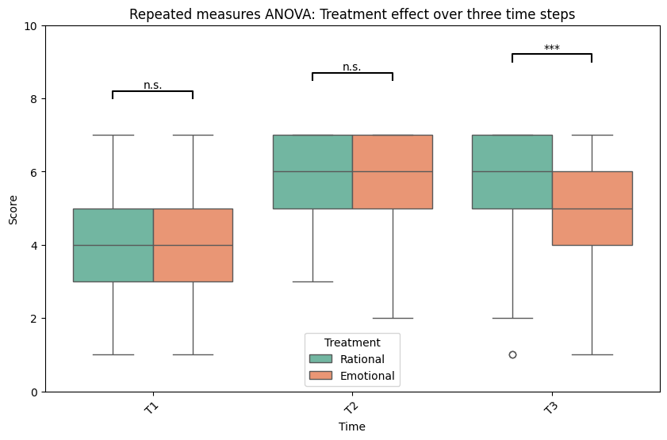

This repository includes code for the sample dataset generator and the analytic model for repeated measure ANOVA.  

<figure>
  
  <figcaption>Figure 1: Repeated measure analysis of variance (ANOVA) showing the distribution of scores across three time steps for participants receiving rational (green) vs. emotional (orange) advertisements. While T1 and T2 show no significant difference (n.s.), T3 exhibits a highly significant difference (***), indicating a strong long-term effect in favor of the rational treatment over the emotional. The datapoints are based on the 7-point Likert scale.</figcaption>
</figure> 

[1] Dataset Generator

The dataset generator is designed to simulate a longitudinal study that captures the long-term effects of interventions by measuring outcomes across three time steps. Unlike a typical pre-post design in randomized controlled trials (RCTs), these time steps provide a more robust depiction of how participant responses evolve over an extended period. In this context, the outcomes are measured using a 7-point Likert scale that assesses the participants' willingness to take a vaccine. This setup allows researchers to observe not only the immediate reaction but also the sustained attitude changes or trends as time progresses.

To achieve a realistic simulation, the code generates data for 5000 participants while maintaining a high study retention rate with a 90% completion rate at the final time step. The synthetic dataset is created based on the expected mean and standard deviation derived from a normal distribution, ensuring that the simulated responses closely mimic real-world data variability. This approach enables analysts to test their models and examine potential patterns or treatment effects with confidence in the underlying data structure.

[2] Demographic Table
describes the general information of the demographics, including age, gender, and income. They are fairly distributed.

#### Age Group Distribution:

| Age Group | Count | Percentage (%) |
|-----------|-------|----------------|
| 18-24     | 832   | 16.64          |
| 25-34     | 804   | 16.08          |
| 35-44     | 784   | 15.68          |
| 45-54     | 836   | 16.72          |
| 55-64     | 870   | 17.40          |
| 65+       | 874   | 17.48          |

#### Gender Distribution:

| Gender    | Count | Percentage (%) |
|-----------|-------|----------------|
| Female    | 2458  | 49.16          |
| Male      | 2542  | 50.84          |

#### Income Distribution:

| Income    | Count | Percentage (%) |
|-----------|-------|----------------|
| High      | 1609  | 32.18          |
| Low       | 1753  | 35.06          |
| Medium    | 1638  | 32.76          |

[3] Repeated Measure ANOVA

The repeated measure ANOVA component of the project is geared towards analyzing the longitudinal dataset to uncover treatment effects over time. This method inherently assumes that the data follow the properties of normality and sphericity—assumptions that are critical to the validity of the statistical inference drawn from the analysis. By meeting these assumptions, the dataset allows for a robust application of repeated measure ANOVA techniques, thereby making it possible to detect subtle changes and interactions across the different time points.

In this analysis, scores from the three time points are compared across different treatment groups to assess whether there are statistically significant changes attributable to the intervention over the long-term period. The code not only conducts the necessary statistical tests but also visualizes the results by plotting the data and annotating significance levels with clear markers. This dual approach of numerical and visual analysis ensures that any observed effects are both statistically sound and intuitively understandable, thereby providing comprehensive insights into the dynamics of the intervention.
